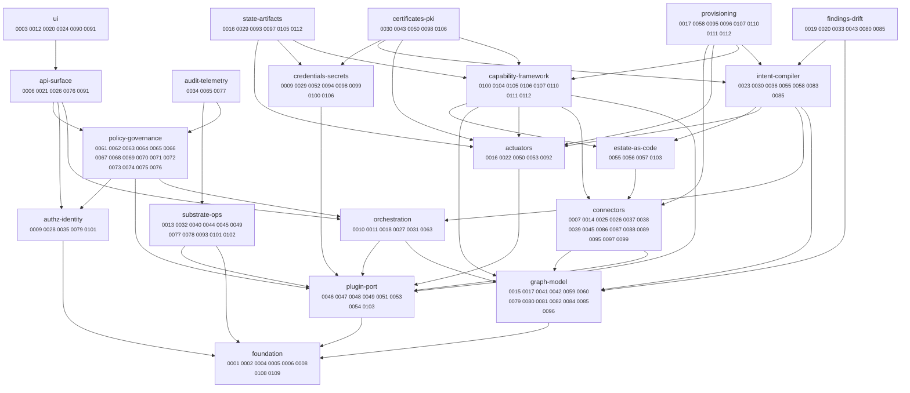

<!-- GENERATED by `task adr:index` from topics.json — DO NOT EDIT. Edit topics.json. (ADR-0109) -->
# ADR Map — the knowledge graph

A **generated navigation router** over the ADR corpus (ADR-0109): a subsystem graph, a
by-topic index, and an ADR→subsystem reverse index. It is a *router*, not a reader — it points
you at the 3–5 relevant ADRs to open, and surfaces *adjacent* subsystems whose decisions a new
design must reconcile with. Chronological list: [README.md](README.md); phase view: [../roadmap.md](../roadmap.md).

## Subsystem graph

## By subsystem

### actuators

Actuators — execution engines (opentofu, helm, mcp, cert-issuer reconcile).

*Depends on:* plugin-port

- [ADR-0016](0016-opentofu-actuator.md) — OpenTofu Actuator: plan/apply behind Gates, encrypted HTTP state backend
- [ADR-0022](0022-mcp-actuator.md) — mcp Actuator: consuming external MCP servers, rung 3
- [ADR-0050](0050-certificate-reconcile-actuator.md) — Certificate lifecycle as a reconcile Actuator (CSR/sign over the port)
- [ADR-0053](0053-mcp-transport-generic-connector.md) — MCP as a generic transport: the last domain logic leaves the core
- [ADR-0092](0092-helm-actuator.md) — Helm Actuator: chart → release behind Gates, over the sovereign port

### api-surface

API surface — OpenAPI /api/v1, the AWX /api/v2 façade, the platform MCP server.

*Depends on:* authz-identity, orchestration, policy-governance

- [ADR-0006](0006-openapi-tooling-oapi-codegen.md) — OpenAPI tooling: spec-first with oapi-codegen
- [ADR-0021](0021-platform-mcp-server.md) — Platform MCP server: the agent surface
- [ADR-0026](0026-awx-api-v2-facade.md) — AWX-compatible `/api/v2` façade (+ native cancel & ansible extraVars)
- [ADR-0076](0076-admission-on-the-imperative-door.md) — Admission on the imperative door: the API is not a bypass around the compile-seam PEP
- [ADR-0091](0091-ui-is-a-first-party-bundled-pure-api-client.md) — the UI is a first-party, served-by-default, pure `/api/v1` client (never a port-plugin, never a gated add-on)

### audit-telemetry

Audit & telemetry — the one audit stream, SIEM forwarder, decision recording, OpenTelemetry.

*Depends on:* policy-governance, substrate-ops

- [ADR-0034](0034-audit-stream-and-siem-forwarder.md) — The one audit stream + vendor-neutral SIEM forwarder
- [ADR-0065](0065-durable-policy-decision-recording.md) — Durable policy-decision recording: the audit stream, not a Finding
- [ADR-0077](0077-observability-otel.md) — Observability: OpenTelemetry providers, `/metrics` always-on, OTLP optional

### authz-identity

Authorization & identity — OpenFGA, Principal, SCIM, workload identity.

*Depends on:* foundation

- [ADR-0009](0009-identity-authz-credential-brokering.md) — Identity, authorization, and credential brokering
- [ADR-0028](0028-view-scoped-execution-authz.md) — View-scoped execution authz (full OpenFGA)
- [ADR-0035](0035-scim-service-provider.md) — SCIM 2.0 Service Provider: IdP-driven Principal lifecycle + group→team authz
- [ADR-0079](0079-identity-as-a-cross-cutting-dimension.md) — Identity is a cross-cutting projection dimension, not a lowest-level type
- [ADR-0101](0101-cluster-authz-activation-openbao-oidc-workload-identity.md) — Activate real cluster authz; OpenBao-OIDC workload identity; multi-issuer Principal resolution

### capability-framework

Capability framework — provides/requires, verification, resolve-inject vs enablement-gate, providers.

*Depends on:* actuators, connectors, estate-as-code, graph-model, plugin-port

- [ADR-0100](0100-keycustodian-kms-envelope-encryption.md) — The KeyCustodian capability: envelope encryption with a self-sufficient local floor and optional, transport-plural KMS providers
- [ADR-0104](0104-plugin-capability-dependencies.md) — Capability dependencies: plugins require capability *contracts*, resolved first-class
- [ADR-0105](0105-s3-capability-provider-agnostic.md) — Capability providers are provider-agnostic: S3 is provider #1 of statestore/artifactstore, never "the provider"
- [ADR-0106](0106-openbao-multi-capability-provider.md) — OpenBao as a multi-capability provider; enablement-gate vs resolve-inject capabilities
- [ADR-0107](0107-ec2-provisioning-provider.md) — EC2 as the `provisioning` capability provider (enablement-gate)
- [ADR-0110](0110-provisioning-class-reach-path.md) — The `provisioning` class reach-path: `Intent.builder:` → `requires: [provisioning]`
- [ADR-0111](0111-ipam-capability-netbox-provider.md) — The `ipam` capability: global IP/VLAN allocation as resolve-inject, NetBox provider #1
- [ADR-0112](0112-opentofu-network-provider-capability-composition.md) — OpenTofu as the AWS network `provisioning` provider, composing statestore + ipam

### certificates-pki

Certificates & PKI — cert lifecycle as a reconcile Actuator, OpenBao PKI.

*Depends on:* actuators, capability-framework, credentials-secrets, intent-compiler

- [ADR-0030](0030-intent-certificate-ga.md) — `Intent/Certificate` GA (certificate lifecycle as first tenant)
- [ADR-0043](0043-cert-renewal-finding-gc.md) — Cert-renewal Finding-GC (resolve Findings for tombstoned Entities)
- [ADR-0050](0050-certificate-reconcile-actuator.md) — Certificate lifecycle as a reconcile Actuator (CSR/sign over the port)
- [ADR-0098](0098-openbao-plugin-consolidation-pki.md) — Consolidate the OpenBao surfaces into `plugins/openbao`; full-featured PKI behind the neutral cert-issuer Contract
- [ADR-0106](0106-openbao-multi-capability-provider.md) — OpenBao as a multi-capability provider; enablement-gate vs resolve-inject capabilities

### connectors

Connectors & Syncers — SoR ingest breadth, the Syncer SDK, adopt/AWX-import.

*Depends on:* graph-model, plugin-port

- [ADR-0007](0007-phase0-syncer-sdk-and-dev-harness.md) — Phase-0 Syncer SDK and dev/test harness: govmomi + vcsim, kind
- [ADR-0014](0014-connector-breadth-msgraph-ec2.md) — Connector breadth: MS Graph and EC2 cloud-instance Syncers
- [ADR-0025](0025-awx-importer-and-ansible-scm-content-ref.md) — AWX importer + ansible SCM content-ref
- [ADR-0026](0026-awx-api-v2-facade.md) — AWX-compatible `/api/v2` façade (+ native cancel & ansible extraVars)
- [ADR-0037](0037-chef-infra-server-syncer.md) — Chef Infra Server node-API Syncer (first config-mgmt SoR ingest)
- [ADR-0038](0038-openvox-puppetdb-syncer.md) — OpenVox/PuppetDB node Syncer + source-scoped config-mgmt facets
- [ADR-0039](0039-salt-connector-syncer-and-emitter.md) — Salt Connector: grains Syncer + event-bus Emitter
- [ADR-0045](0045-db-driven-syncer-home-gate.md) — DB-driven Syncer instantiation & Connector home-ownership gate (full re-home auto-cutover)
- [ADR-0086](0086-adopt-per-object-in-place.md) — `adopt`: per-object, in-place, over the live projection (supersedes-in-part the one-shot importer)
- [ADR-0087](0087-standing-cutover-reconciler.md) — Standing cutover: a desired-state⋈projection reconciler, not a projection-only Baseline
- [ADR-0088](0088-adopt-as-a-job.md) — adopt-as-a-job: the credential-bearing deep-read + transform runs in a first-party execution pod
- [ADR-0089](0089-awximport-to-awx-plugin.md) — the AWX→CaC transform is plugin breadth: move `awximport` into the awx plugin
- [ADR-0095](0095-full-featured-ec2-connector.md) — Full-featured EC2 connector: instance lifecycle + resource Actions, and the instance.* Facet contracts
- [ADR-0097](0097-awss3-connector.md) — The awss3 Connector: bucket lifecycle Actions + metadata-only bucket Syncer
- [ADR-0099](0099-openbao-kv-metadata-syncer.md) — OpenBao KV metadata Syncer: secret existence/metadata as a projection, never material

### credentials-secrets

Credentials & secrets (§2.5) — brokering, the SecretBroker port, KV, KeyCustodian.

*Depends on:* plugin-port

- [ADR-0009](0009-identity-authz-credential-brokering.md) — Identity, authorization, and credential brokering
- [ADR-0029](0029-evidence-store-object-lock.md) — Evidence store (object-locked audit bundles)
- [ADR-0052](0052-secretbroker-port.md) — The SecretBroker port: per-call credential resolution for plugins (§2.5)
- [ADR-0094](0094-secretbroker-openbao-vault-backend.md) — SecretBroker OpenBao/Vault backend: per-call material from a KV store (§2.5)
- [ADR-0098](0098-openbao-plugin-consolidation-pki.md) — Consolidate the OpenBao surfaces into `plugins/openbao`; full-featured PKI behind the neutral cert-issuer Contract
- [ADR-0099](0099-openbao-kv-metadata-syncer.md) — OpenBao KV metadata Syncer: secret existence/metadata as a projection, never material
- [ADR-0100](0100-keycustodian-kms-envelope-encryption.md) — The KeyCustodian capability: envelope encryption with a self-sufficient local floor and optional, transport-plural KMS providers
- [ADR-0106](0106-openbao-multi-capability-provider.md) — OpenBao as a multi-capability provider; enablement-gate vs resolve-inject capabilities

### estate-as-code

Estate-as-Code — CaC declarations, environments, composition, the estate CLI.

*Depends on:* connectors

- [ADR-0055](0055-estate-composition.md) — Estate Composition: what it means to "define the estate"
- [ADR-0056](0056-estate-as-code.md) — Estate-as-Code: declaring Sources & Connectors in Git + the `stratt` estate CLI
- [ADR-0057](0057-environment-scoped-reconciliation.md) — Environment-scoped reconciliation: one estate repo, N environments
- [ADR-0103](0103-runtime-connector-registry.md) — Runtime Connector registry: enable/disable Connectors without a strattd restart

### findings-drift

Findings & drift — Baselines, Findings, compliance packs, drift/GC.

*Depends on:* graph-model, intent-compiler

- [ADR-0019](0019-baselines-findings-v1.md) — Baselines + Findings v1: check-mode + tofu plan, flap damping
- [ADR-0020](0020-findings-ui.md) — Findings UI: the estate drift screen
- [ADR-0033](0033-cis-pack-compliance-as-data.md) — CIS pack: compliance frameworks as data over a reusable projection
- [ADR-0043](0043-cert-renewal-finding-gc.md) — Cert-renewal Finding-GC (resolve Findings for tombstoned Entities)
- [ADR-0080](0080-software-as-an-estate-dimension.md) — Software as an estate dimension: installed packages, open delivery-form, patch/advisory Findings
- [ADR-0085](0085-relation-presence-baseline.md) — Relation-presence Baseline: desired state over graph topology, not just node facets

### foundation

Foundation — charter authority, control plane, language/tooling, monorepo, meta-process.

- [ADR-0001](0001-charter-as-design-authority-and-claude-control-plane.md) — Charter as design authority; Claude Code as the initial build surface
- [ADR-0002](0002-go-control-plane-python-in-pods-s3-generic-storage.md) — Go control plane; Python confined to pods & SDK; S3-generic storage
- [ADR-0004](0004-db-tooling-pgx-goose.md) — Postgres tooling: pgx queries, goose migrations
- [ADR-0005](0005-phase0-monorepo-layout-multi-module-workspace.md) — Phase-0 monorepo layout: multi-module Go workspace
- [ADR-0006](0006-openapi-tooling-oapi-codegen.md) — OpenAPI tooling: spec-first with oapi-codegen
- [ADR-0008](0008-phase0-go-no-go-measurements.md) — Phase-0 go/no-go gate measurements: graph spine proves out
- [ADR-0108](0108-adr-scout-prior-art-scan.md) — `adr-scout` + a mandatory prior-art scan before drafting an ADR
- [ADR-0109](0109-adr-knowledge-graph.md) — The ADR knowledge graph: a generated subsystem map for discovery

### graph-model

Graph model — Entity/Facet/Relation/Contract primitives, projection & liveness.

*Depends on:* foundation

- [ADR-0015](0015-contracts-v1.md) — Contracts v1: pinned, hash-verified JSON Schema at the seams
- [ADR-0017](0017-tofu-outputs-to-entities.md) — tofu outputs → Entities: the provision→configure seam
- [ADR-0041](0041-per-key-entity-label-ownership.md) — Per-key Entity-label ownership (the label mirror of facet_owner)
- [ADR-0042](0042-cross-source-entity-liveness.md) — Cross-source Entity liveness (per-Source presence) + observedBy
- [ADR-0059](0059-network-topology-primitives.md) — Network & topology primitives: subnets, zones, DNS, and placement as a Relation
- [ADR-0060](0060-multi-source-facet-ownership.md) — Multi-source Facet projection: keep every signal, declare the authoritative view
- [ADR-0079](0079-identity-as-a-cross-cutting-dimension.md) — Identity is a cross-cutting projection dimension, not a lowest-level type
- [ADR-0080](0080-software-as-an-estate-dimension.md) — Software as an estate dimension: installed packages, open delivery-form, patch/advisory Findings
- [ADR-0081](0081-service-as-a-capability-dimension.md) — Service as a capability dimension: the deliverable↔service seam, grounded in K8s + Helm
- [ADR-0082](0082-relation-liveness.md) — Relation liveness: cross-source edge GC, the edge analog of entity presence
- [ADR-0084](0084-managed-node-reachability-address-facet.md) — Managed-node reachability is a typed address Facet; core resolves the connection seam, the plugin renders the connection
- [ADR-0085](0085-relation-presence-baseline.md) — Relation-presence Baseline: desired state over graph topology, not just node facets
- [ADR-0096](0096-ec2-resource-graph-entities.md) — The EC2 resource graph: VPC / subnet / security-group / volume as Observed Entities

### intent-compiler

Intent compiler — Intent/Assignment/Blueprint/Baseline compile to Runs.

*Depends on:* actuators, estate-as-code, graph-model, orchestration

- [ADR-0023](0023-intent-compiler.md) — Intent/Assignment/Blueprint compiler
- [ADR-0030](0030-intent-certificate-ga.md) — `Intent/Certificate` GA (certificate lifecycle as first tenant)
- [ADR-0036](0036-intent-fileset-access-ga.md) — `Intent/FileSet` + `Intent/Access` GA (file distribution + host-access governance)
- [ADR-0055](0055-estate-composition.md) — Estate Composition: what it means to "define the estate"
- [ADR-0058](0058-provisioning-from-intent.md) — Provisioning from Intent: declaring & building desired infrastructure
- [ADR-0083](0083-blueprint-route-materialization-seam.md) — The Blueprint route is the tool-materialization seam; declare outcomes, plugins materialize (+ G6 defaults/override)
- [ADR-0085](0085-relation-presence-baseline.md) — Relation-presence Baseline: desired state over graph topology, not just node facets

### orchestration

Orchestration — Triggers, Workflows/Gates, Steps, Runs, Actions, notifications.

*Depends on:* graph-model, plugin-port

- [ADR-0010](0010-triggers-v1-schedules.md) — Triggers v1: the `schedule` kind on Temporal Schedules
- [ADR-0011](0011-workflows-gates-v1.md) — Workflows + Gates v1: Step DAGs with human approval
- [ADR-0018](0018-trigger-engine.md) — Trigger engine: Emitters × CEL → launches
- [ADR-0027](0027-notifications.md) — Notifications (outbound Run/Finding/Gate alerts)
- [ADR-0031](0031-action-execution-framework.md) — Action-execution framework (+ provision→configure seam)
- [ADR-0063](0063-policy-step-dag-dispatch-v1.md) — Policy Step & DAG dispatch v1: the PDP as a synchronous checkpoint

### plugin-port

Sovereign plugin port — the dark-matter substrate, transports, runtime registry.

*Depends on:* foundation

- [ADR-0046](0046-stratt-as-substrate.md) — Stratt as Substrate: the dark-matter re-centering and the sovereign plugin port
- [ADR-0047](0047-plugin-port-v1-full-surface.md) — Plugin port v1 full surface: write-back, relations, and the rung ladder over the wire
- [ADR-0048](0048-integration-taxonomy-plugin-tool-transport.md) — Where an integration lives: connector (plugin) vs migration (tool) vs transport (core port)
- [ADR-0049](0049-sites-over-the-plugin-port.md) — Sites over the plugin port: the agent as an authenticated transport relay, never a governor
- [ADR-0051](0051-ee-job-speaks-the-port.md) — The EE Job speaks the port: a subprocess transport, one governor
- [ADR-0053](0053-mcp-transport-generic-connector.md) — MCP as a generic transport: the last domain logic leaves the core
- [ADR-0054](0054-per-step-facet-claim.md) — Per-Step facet write-scope: narrow the write-back grant to what a Step declares
- [ADR-0103](0103-runtime-connector-registry.md) — Runtime Connector registry: enable/disable Connectors without a strattd restart

### policy-governance

Policy & governance — the PDP port, typed Controls, admission PEPs, obligations.

*Depends on:* authz-identity, orchestration, plugin-port

- [ADR-0061](0061-estate-governance-policy-decision-point.md) — Estate Governance: the policy decision point, the three authorships, and governance-as-data
- [ADR-0062](0062-policy-contract-and-pdp-interface-v1.md) — Policy Contract & PDP interface v1: the four-way Decision, the CEL evaluator, and the most-restrictive lattice
- [ADR-0063](0063-policy-step-dag-dispatch-v1.md) — Policy Step & DAG dispatch v1: the PDP as a synchronous checkpoint
- [ADR-0064](0064-policy-require-approval-gate.md) — Policy REQUIRE_APPROVAL opens a human Gate; the approver check folds into one authz seam
- [ADR-0065](0065-durable-policy-decision-recording.md) — Durable policy-decision recording: the audit stream, not a Finding
- [ADR-0066](0066-mandatory-floors-pre-existing.md) — The mandatory safety floors pre-exist and are non-substitutable (ADR-0061 M1, closed)
- [ADR-0067](0067-typed-control-library-timewindow.md) — The typed Control library: primitives as data, starting with TimeWindow
- [ADR-0068](0068-typed-control-sod.md) — Typed Control library: Separation of Duties, and committer enrichment
- [ADR-0069](0069-typed-control-waiver.md) — Typed Control library: Waiver, a time-boxed control exemption
- [ADR-0070](0070-typed-control-breakglass.md) — Typed Control library: BreakGlass, emergency bypass with mandatory post-review
- [ADR-0071](0071-quorum-gate-threshold.md) — Quorum (M-of-N): a gate threshold, not an evaluator Control
- [ADR-0072](0072-policy-decision-point-is-a-port.md) — The Policy Decision Point is a PORT, not a core dependency (corrects ADR-0062)
- [ADR-0073](0073-admission-pep-over-the-port.md) — The admission PEP: policy at the compile seam, over the PDP port
- [ADR-0074](0074-external-policy-engine-subprocess.md) — External policy engines (OPA / Kyverno) over the subprocess transport
- [ADR-0075](0075-obligation-enforcement.md) — Obligation enforcement: a binding rider is enforced, not recorded-and-dropped
- [ADR-0076](0076-admission-on-the-imperative-door.md) — Admission on the imperative door: the API is not a bypass around the compile-seam PEP

### provisioning

Provisioning — declare & build infra (Intent -> builder -> machines), provision->configure.

*Depends on:* actuators, capability-framework, connectors, intent-compiler

- [ADR-0017](0017-tofu-outputs-to-entities.md) — tofu outputs → Entities: the provision→configure seam
- [ADR-0058](0058-provisioning-from-intent.md) — Provisioning from Intent: declaring & building desired infrastructure
- [ADR-0095](0095-full-featured-ec2-connector.md) — Full-featured EC2 connector: instance lifecycle + resource Actions, and the instance.* Facet contracts
- [ADR-0096](0096-ec2-resource-graph-entities.md) — The EC2 resource graph: VPC / subnet / security-group / volume as Observed Entities
- [ADR-0107](0107-ec2-provisioning-provider.md) — EC2 as the `provisioning` capability provider (enablement-gate)
- [ADR-0110](0110-provisioning-class-reach-path.md) — The `provisioning` class reach-path: `Intent.builder:` → `requires: [provisioning]`
- [ADR-0111](0111-ipam-capability-netbox-provider.md) — The `ipam` capability: global IP/VLAN allocation as resolve-inject, NetBox provider #1
- [ADR-0112](0112-opentofu-network-provider-capability-composition.md) — OpenTofu as the AWS network `provisioning` provider, composing statestore + ipam

### state-artifacts

Tool state & artifacts — state backend, evidence store, object storage, statestore/artifactstore.

*Depends on:* actuators, capability-framework, credentials-secrets

- [ADR-0016](0016-opentofu-actuator.md) — OpenTofu Actuator: plan/apply behind Gates, encrypted HTTP state backend
- [ADR-0029](0029-evidence-store-object-lock.md) — Evidence store (object-locked audit bundles)
- [ADR-0093](0093-real-dev-backends-floci-seaweedfs.md) — Real dev backends: Floci (EC2) replaces moto; SeaweedFS bump (S3)
- [ADR-0097](0097-awss3-connector.md) — The awss3 Connector: bucket lifecycle Actions + metadata-only bucket Syncer
- [ADR-0105](0105-s3-capability-provider-agnostic.md) — Capability providers are provider-agnostic: S3 is provider #1 of statestore/artifactstore, never "the provider"
- [ADR-0112](0112-opentofu-network-provider-capability-composition.md) — OpenTofu as the AWS network `provisioning` provider, composing statestore + ipam

### substrate-ops

Substrate & ops — HA/DR, Cells/multi-region, Sites, deploy, bootstrap, upgrade, observability, dev backends.

*Depends on:* foundation, plugin-port

- [ADR-0013](0013-helm-packaging.md) — Helm packaging: any-Kubernetes self-host
- [ADR-0032](0032-sites-remote-execution-loci.md) — Sites: remote execution loci (NATS-leaf push; cosign/OCI pull Bundles)
- [ADR-0040](0040-high-availability-and-disaster-recovery.md) — High Availability & Disaster Recovery architecture
- [ADR-0044](0044-control-plane-cells.md) — Control-plane Cells / multi-region (partitioned single-writer, one logical estate)
- [ADR-0045](0045-db-driven-syncer-home-gate.md) — DB-driven Syncer instantiation & Connector home-ownership gate (full re-home auto-cutover)
- [ADR-0049](0049-sites-over-the-plugin-port.md) — Sites over the plugin port: the agent as an authenticated transport relay, never a governor
- [ADR-0077](0077-observability-otel.md) — Observability: OpenTelemetry providers, `/metrics` always-on, OTLP optional
- [ADR-0078](0078-rolling-upgrade-expand-contract.md) — Rolling-upgrade schema discipline: expand/contract + a pre-upgrade migration Job
- [ADR-0093](0093-real-dev-backends-floci-seaweedfs.md) — Real dev backends: Floci (EC2) replaces moto; SeaweedFS bump (S3)
- [ADR-0101](0101-cluster-authz-activation-openbao-oidc-workload-identity.md) — Activate real cluster authz; OpenBao-OIDC workload identity; multi-issuer Principal resolution
- [ADR-0102](0102-tiered-genesis-bootstrap.md) — Tiered genesis bootstrap: a minimal self-retiring floor, then Stratt self-deploys the rest

### ui

UI — React shell, schema-driven rendering, Views, descent, the first-party client.

*Depends on:* api-surface

- [ADR-0003](0003-ux-design-principles-schema-driven-rendering-and-descent.md) — UX design principles: schema-driven rendering and one-click descent
- [ADR-0012](0012-views-ui-v1.md) — Views UI v1: React shell, OIDC login, descent screens
- [ADR-0020](0020-findings-ui.md) — Findings UI: the estate drift screen
- [ADR-0024](0024-templating-parametrized-views.md) — Payload templating + parametrized Views
- [ADR-0090](0090-ui-rebuild-greenfield-charter-stack.md) — UI rebuild: greenfield on the charter stack, gauntlet-informed patterns
- [ADR-0091](0091-ui-is-a-first-party-bundled-pure-api-client.md) — the UI is a first-party, served-by-default, pure `/api/v1` client (never a port-plugin, never a gated add-on)

## By ADR (reverse index)

| ADR | Subsystems |
|---|---|
| [0001](0001-charter-as-design-authority-and-claude-control-plane.md) | foundation |
| [0002](0002-go-control-plane-python-in-pods-s3-generic-storage.md) | foundation |
| [0003](0003-ux-design-principles-schema-driven-rendering-and-descent.md) | ui |
| [0004](0004-db-tooling-pgx-goose.md) | foundation |
| [0005](0005-phase0-monorepo-layout-multi-module-workspace.md) | foundation |
| [0006](0006-openapi-tooling-oapi-codegen.md) | api-surface, foundation |
| [0007](0007-phase0-syncer-sdk-and-dev-harness.md) | connectors |
| [0008](0008-phase0-go-no-go-measurements.md) | foundation |
| [0009](0009-identity-authz-credential-brokering.md) | authz-identity, credentials-secrets |
| [0010](0010-triggers-v1-schedules.md) | orchestration |
| [0011](0011-workflows-gates-v1.md) | orchestration |
| [0012](0012-views-ui-v1.md) | ui |
| [0013](0013-helm-packaging.md) | substrate-ops |
| [0014](0014-connector-breadth-msgraph-ec2.md) | connectors |
| [0015](0015-contracts-v1.md) | graph-model |
| [0016](0016-opentofu-actuator.md) | actuators, state-artifacts |
| [0017](0017-tofu-outputs-to-entities.md) | graph-model, provisioning |
| [0018](0018-trigger-engine.md) | orchestration |
| [0019](0019-baselines-findings-v1.md) | findings-drift |
| [0020](0020-findings-ui.md) | findings-drift, ui |
| [0021](0021-platform-mcp-server.md) | api-surface |
| [0022](0022-mcp-actuator.md) | actuators |
| [0023](0023-intent-compiler.md) | intent-compiler |
| [0024](0024-templating-parametrized-views.md) | ui |
| [0025](0025-awx-importer-and-ansible-scm-content-ref.md) | connectors |
| [0026](0026-awx-api-v2-facade.md) | api-surface, connectors |
| [0027](0027-notifications.md) | orchestration |
| [0028](0028-view-scoped-execution-authz.md) | authz-identity |
| [0029](0029-evidence-store-object-lock.md) | credentials-secrets, state-artifacts |
| [0030](0030-intent-certificate-ga.md) | certificates-pki, intent-compiler |
| [0031](0031-action-execution-framework.md) | orchestration |
| [0032](0032-sites-remote-execution-loci.md) | substrate-ops |
| [0033](0033-cis-pack-compliance-as-data.md) | findings-drift |
| [0034](0034-audit-stream-and-siem-forwarder.md) | audit-telemetry |
| [0035](0035-scim-service-provider.md) | authz-identity |
| [0036](0036-intent-fileset-access-ga.md) | intent-compiler |
| [0037](0037-chef-infra-server-syncer.md) | connectors |
| [0038](0038-openvox-puppetdb-syncer.md) | connectors |
| [0039](0039-salt-connector-syncer-and-emitter.md) | connectors |
| [0040](0040-high-availability-and-disaster-recovery.md) | substrate-ops |
| [0041](0041-per-key-entity-label-ownership.md) | graph-model |
| [0042](0042-cross-source-entity-liveness.md) | graph-model |
| [0043](0043-cert-renewal-finding-gc.md) | certificates-pki, findings-drift |
| [0044](0044-control-plane-cells.md) | substrate-ops |
| [0045](0045-db-driven-syncer-home-gate.md) | connectors, substrate-ops |
| [0046](0046-stratt-as-substrate.md) | plugin-port |
| [0047](0047-plugin-port-v1-full-surface.md) | plugin-port |
| [0048](0048-integration-taxonomy-plugin-tool-transport.md) | plugin-port |
| [0049](0049-sites-over-the-plugin-port.md) | plugin-port, substrate-ops |
| [0050](0050-certificate-reconcile-actuator.md) | actuators, certificates-pki |
| [0051](0051-ee-job-speaks-the-port.md) | plugin-port |
| [0052](0052-secretbroker-port.md) | credentials-secrets |
| [0053](0053-mcp-transport-generic-connector.md) | actuators, plugin-port |
| [0054](0054-per-step-facet-claim.md) | plugin-port |
| [0055](0055-estate-composition.md) | estate-as-code, intent-compiler |
| [0056](0056-estate-as-code.md) | estate-as-code |
| [0057](0057-environment-scoped-reconciliation.md) | estate-as-code |
| [0058](0058-provisioning-from-intent.md) | intent-compiler, provisioning |
| [0059](0059-network-topology-primitives.md) | graph-model |
| [0060](0060-multi-source-facet-ownership.md) | graph-model |
| [0061](0061-estate-governance-policy-decision-point.md) | policy-governance |
| [0062](0062-policy-contract-and-pdp-interface-v1.md) | policy-governance |
| [0063](0063-policy-step-dag-dispatch-v1.md) | orchestration, policy-governance |
| [0064](0064-policy-require-approval-gate.md) | policy-governance |
| [0065](0065-durable-policy-decision-recording.md) | audit-telemetry, policy-governance |
| [0066](0066-mandatory-floors-pre-existing.md) | policy-governance |
| [0067](0067-typed-control-library-timewindow.md) | policy-governance |
| [0068](0068-typed-control-sod.md) | policy-governance |
| [0069](0069-typed-control-waiver.md) | policy-governance |
| [0070](0070-typed-control-breakglass.md) | policy-governance |
| [0071](0071-quorum-gate-threshold.md) | policy-governance |
| [0072](0072-policy-decision-point-is-a-port.md) | policy-governance |
| [0073](0073-admission-pep-over-the-port.md) | policy-governance |
| [0074](0074-external-policy-engine-subprocess.md) | policy-governance |
| [0075](0075-obligation-enforcement.md) | policy-governance |
| [0076](0076-admission-on-the-imperative-door.md) | api-surface, policy-governance |
| [0077](0077-observability-otel.md) | audit-telemetry, substrate-ops |
| [0078](0078-rolling-upgrade-expand-contract.md) | substrate-ops |
| [0079](0079-identity-as-a-cross-cutting-dimension.md) | authz-identity, graph-model |
| [0080](0080-software-as-an-estate-dimension.md) | findings-drift, graph-model |
| [0081](0081-service-as-a-capability-dimension.md) | graph-model |
| [0082](0082-relation-liveness.md) | graph-model |
| [0083](0083-blueprint-route-materialization-seam.md) | intent-compiler |
| [0084](0084-managed-node-reachability-address-facet.md) | graph-model |
| [0085](0085-relation-presence-baseline.md) | findings-drift, graph-model, intent-compiler |
| [0086](0086-adopt-per-object-in-place.md) | connectors |
| [0087](0087-standing-cutover-reconciler.md) | connectors |
| [0088](0088-adopt-as-a-job.md) | connectors |
| [0089](0089-awximport-to-awx-plugin.md) | connectors |
| [0090](0090-ui-rebuild-greenfield-charter-stack.md) | ui |
| [0091](0091-ui-is-a-first-party-bundled-pure-api-client.md) | api-surface, ui |
| [0092](0092-helm-actuator.md) | actuators |
| [0093](0093-real-dev-backends-floci-seaweedfs.md) | state-artifacts, substrate-ops |
| [0094](0094-secretbroker-openbao-vault-backend.md) | credentials-secrets |
| [0095](0095-full-featured-ec2-connector.md) | connectors, provisioning |
| [0096](0096-ec2-resource-graph-entities.md) | graph-model, provisioning |
| [0097](0097-awss3-connector.md) | connectors, state-artifacts |
| [0098](0098-openbao-plugin-consolidation-pki.md) | certificates-pki, credentials-secrets |
| [0099](0099-openbao-kv-metadata-syncer.md) | connectors, credentials-secrets |
| [0100](0100-keycustodian-kms-envelope-encryption.md) | capability-framework, credentials-secrets |
| [0101](0101-cluster-authz-activation-openbao-oidc-workload-identity.md) | authz-identity, substrate-ops |
| [0102](0102-tiered-genesis-bootstrap.md) | substrate-ops |
| [0103](0103-runtime-connector-registry.md) | estate-as-code, plugin-port |
| [0104](0104-plugin-capability-dependencies.md) | capability-framework |
| [0105](0105-s3-capability-provider-agnostic.md) | capability-framework, state-artifacts |
| [0106](0106-openbao-multi-capability-provider.md) | capability-framework, certificates-pki, credentials-secrets |
| [0107](0107-ec2-provisioning-provider.md) | capability-framework, provisioning |
| [0108](0108-adr-scout-prior-art-scan.md) | foundation |
| [0109](0109-adr-knowledge-graph.md) | foundation |
| [0110](0110-provisioning-class-reach-path.md) | capability-framework, provisioning |
| [0111](0111-ipam-capability-netbox-provider.md) | capability-framework, provisioning |
| [0112](0112-opentofu-network-provider-capability-composition.md) | capability-framework, provisioning, state-artifacts |
