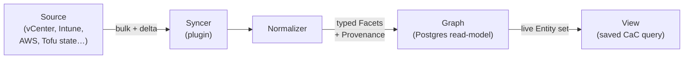
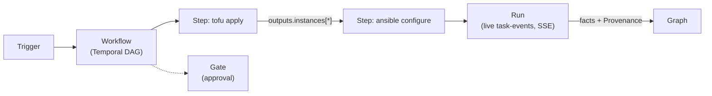
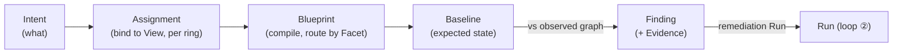
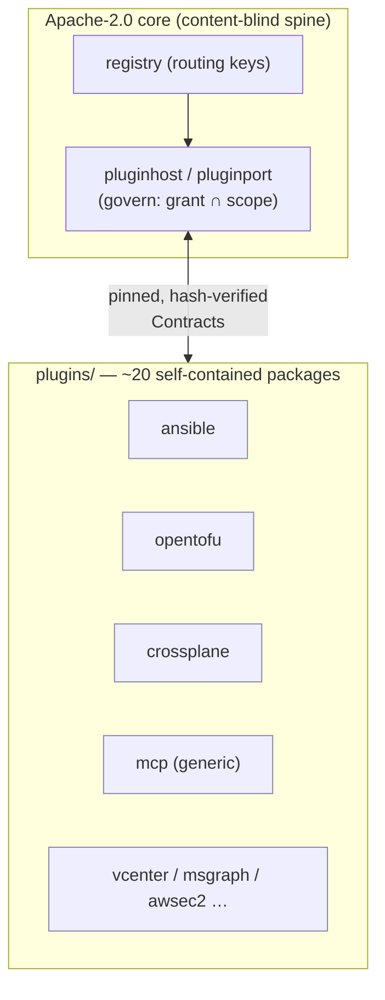

# How Stratt works

> Companion to **[overview.md](overview.md)** (what Stratt is + the mental model). This doc is the
> engineering-level "how does it work": what runs, the three runtime loops, how a tool plugs in, and
> where everything lives in the repo. The **[charter](../stratt-charter.md)** is the design authority.

---

## What runs — the deployable shape

Stratt is a Kubernetes-native control plane. The Go core is one codebase producing a few binaries
(`core/cmd/`):

| Binary | Role |
|---|---|
| **`strattd`** | The control plane: the API server, the reconciliation controllers (sync, dispatch, compile, homing), the graph-store frontend, the event bus, and the agent-native MCP server. Serves the built UI (`go:embed`). Runs 3-replica with leader election for HA. |
| **`stratt`** | The CLI — a pure API client, same as the UI (`plan`/`apply`, run, describe…). |
| **`stratt-agent`** | The pull agent / Site dispatcher — a NATS-leaf satellite that executes Bundles at a remote **Site**; an authenticated relay, with governance staying hub-side. |
| **`stratt-forwarder`** | Ships the audit stream to an external SIEM sink. |
| **`stratt-dev-seed` / `stratt-dev-assert`** | Dev-harness helpers (seed data, e2e assertions). |

Around `strattd` sit the boring-spine dependencies: **Postgres** (graph + desired state), **NATS
JetStream** (event bus, Site leaves, live SSE), **Temporal** (durable Workflows), **OpenFGA** (authz),
**OIDC** (identity), an **S3-compatible** object store (Evidence, Bundles, Tofu state). Tools run as
**plugins** in their own pods/images.

## The three runtime loops

Everything Stratt does is one of three reconciliation loops over the graph. They share the graph, the
Contracts, and the one authz/audit spine.

### ① The projection loop — keeping the graph true

External systems of record are authoritative; the graph is a rebuildable read-model. A **Syncer**
enumerates a **Source**, a **Normalizer** maps raw records into typed Entities/Facets/Relations, and
every attribute lands with **Provenance**. Two writers to one Facet namespace is a registration error —
provenance is a lineage, never a fight.



Only Normalizers and Run provenance may write Entity attributes — **enforced in the data layer, not by
convention**. Rebuild the graph from the Sources any time; nothing is lost.

### ② The orchestration loop — making changes

A **Run** starts from a **Trigger** (a Schedule, an Emitter event matched by a rule, a manual click, or
an API/MCP call). A **Workflow** is a Temporal-backed DAG of **Steps** — each either an **Actuator**
running tool content (Ansible, OpenTofu…) or an **Action** making one contracted call — with **Gates**
for human/policy approval. The seam feature: one Step's typed outputs bind directly into the next Step's
inputs, so provision→configure is one graph, one RBAC model, one audit stream. When a Run finishes it
writes facts back to the graph with provenance — closing loop ② into loop ①.



Live task events stream over SSE (`GET /runs/{id}/events`) — the virtualized live log is a
center-of-gravity UI surface, because **the abstraction must never hide diagnosis** (§1.8).

### ③ The intent/drift loop — desired state

Teams write **Intents** (small "what" documents). An **Assignment** binds an Intent to a View per
environment/ring. A **Blueprint** compiles (Intent × Assignment × View membership) into **Baselines** —
expected Facet values and/or a check Step plus a remediation Workflow — **routed by capability-scoped
Facets** (`mgmt.channels: {apps: intune, certs: ansible}`, because co-management is reality). The
difference between expected and observed is a **Finding**, backed by immutable **Evidence**. A Finding's
remediation is just a Run — which drops back into loop ②.



Claims are **exclusive** (one Assignment per Entity — a double-claim is a compile error) or **additive**
(set-union with per-element provenance). **There is no implicit precedence anywhere** — the anti-GPO
axiom.

### The spine: one-click descent

The three loops meet at diagnosis. From any Intent you descend the full ladder —
**Intent → Blueprint route → Workflow → Run → task event** — every hop a stored, URL-addressable
reference. This is a hard product invariant (§1.8), not a nice-to-have.

## The sovereign plugin port — how a tool plugs in

The largest architectural fact about the codebase: after the **dark-matter re-centering**
([ADR-0046](adr/0046-stratt-as-substrate.md)), the core is **content-blind**. `core/internal/actuators`
and `core/internal/actions` hold *only the seam interfaces* — there is no tool logic and no
platform-default actuator in the core. Every tool lives in `plugins/` behind one **sovereign plugin
port**, and the execution path routes by **registry lookup, not a tool-name switch**.



Key properties of the port:

- **Sovereign contract, multiple transports.** The plugin contract is Stratt's own; REST/gRPC,
  subprocess, and MCP are transports *beneath* it. No external protocol is load-bearing for the
  deterministic core.
- **Schemas are pinned and hash-verified at registration.** Schema drift is detected and **blocking**,
  never silently absorbed.
- **Least-authority write-back.** A Step writes facets only within `grant ∩ scope` at the one governor
  ([ADR-0054](adr/0054-per-step-facet-claim.md)) — so a plugin can never write outside what it was
  granted.
- **GPL stays outside the core.** Ansible is subprocess-only, run by an Execution-Environment Job that
  *speaks the port* ([ADR-0051](adr/0051-ee-job-speaks-the-port.md)); the Go control plane never links
  it.
- **The core holds no credential material.** A **SecretBroker** port resolves credentials per-call
  ([ADR-0052](adr/0052-secretbroker-port.md)); the control plane deals only in **coordinates**
  (`CredentialRef`), never material (§2.5).

The ~20 plugins today span config management (ansible, chef, puppet, salt), IaC (opentofu, crossplane),
virtualization/cloud/identity Syncers (vcenter, awsec2, msgraph, netbox), Kubernetes (kubecontainers,
kubeservices), certificates (certissuer), notifications (notify), the generic MCP transport (mcp), and
the AWX migration tool (awx).

## Identity, authorization, audit — one model for everyone

A **Principal** is a human or a service/agent identity — one kind. An AI agent launching a Workflow over
MCP lives in the *same* authz, audit, and cost model as a human in the UI (§1.6):

- **AuthN:** OIDC (Zitadel in dev).
- **AuthZ:** OpenFGA relationship tuples, including **View-scoped execution** and **use-without-read**
  ([ADR-0028](adr/0028-view-scoped-execution-authz.md)).
- **Audit:** one append-only stream for every action across UI/CLI/CI/MCP, forwardable to a SIEM
  ([ADR-0034](adr/0034-audit-stream-and-siem-forwarder.md)).
- **Cost/usage** accounting is per identity.

## The API and agent surface

The API is **OpenAPI-first** (`core/api/openapi.yaml`, ~50 paths): views, entities, desired-state
(plan/apply), runs (+events), contracts, intents/assignments/blueprints/compile, baselines, findings
(+evidence), workflows/workflow-runs/gates, triggers, sources (+rehome), sites, audit, usage. The UI and
CLI are pure clients of it ([ADR-0091](adr/0091-ui-is-a-first-party-bundled-pure-api-client.md)) — a UI
capability requires the API capability *first*, so any change is cleanly *either* backend/contract *or*
presentation. The same surface is exposed to agents via the MCP server (`core/internal/mcpserver`).

## Multi-region: Cells and Sites

- A **Cell** is a region-local, single-writer control-plane shard with its own boring-spine substrate.
  The fleet is many Cells presenting **one logical estate**, active/active, with **each datum having
  exactly one home Cell** — no multi-master. The built-in default is a single Cell named `local`.
  Reads federate across Cells (a `206 Partial Content` tells the honest truth when a peer is
  unreachable); a **Source re-home** is a fenced, two-phase move ([ADR-0044](adr/0044-control-plane-cells.md)/[0045](adr/0045-db-driven-syncer-home-gate.md)).
- A **Site** is a remote execution locus *within* a Cell — a NATS-leaf satellite dispatcher that runs
  signed **Bundles** in pull mode, so execution can happen close to the managed estate without opening
  the estate to the hub.

## Repo layout

```
core/            The Go control plane
  cmd/           strattd, stratt (CLI), stratt-agent, stratt-forwarder, dev helpers
  internal/      the spine: graph, orchestrate, dispatch, compiler, desiredstate,
                 baselines, authz, audit, forwarder, evidencestore, triggers,
                 emitters, notify, mcpserver, cellrouter, homegate, sitegw,
                 pluginhost/pluginport, contract, … (~42 packages)
  api/           openapi.yaml — the single seam (generates the UI/CLI types)
ui/              React + TS + Vite — a first-party, pure /api/v1 client
types/           Shared Go types for the Named Kinds (Entity, Run, Finding, Cell…)
contracts/       Pinned JSON-Schema Contracts (Action/Actuator inputs & outputs)
plugins/         ~20 self-contained tool plugins (each own go.mod + cmd + Dockerfile)
sdk/             The plugin SDK (plugin/v1, secretbroker) — Connector/Actuator authors
proto/           Wire definitions for the typed Site stream
packs/           Compliance-as-data packs (e.g. CIS)
deploy/          Helm chart (deploy/charts/stratt) + dev substrate config
docs/            This tree — overview, architecture, roadmap, ADRs, runbooks, ux, evidence
```

## Running it (dev)

The dev environment is **fully task-driven** (`task`, from `Taskfile.yml`) — the same artifacts as
production, nothing hand-configured:

- `task setup` — bootstrap the toolchain.
- `task dev …` — bring up the substrate (Postgres/NATS/Temporal) and `strattd`; seed dev data.
- `task test` / `task ci` — the test + full CI gate (build, lint, typecheck, tests, generate-check).
- `task e2e …` — end-to-end harnesses, including the two-Cell multi-region drill (`task e2e:cells`).
- Deploy is the **real artifact**: the Helm chart at `deploy/charts/stratt`.

Run `task` (or `task default`) to list the available targets.

## The honest edges

This is structurally complete and unit/integration-tested, but **a full live end-to-end run on a real
NATS + K8s + Temporal cluster is still outstanding**, and the enforcement wiring + operational envelope
(admission on the API, EE-Job sandboxing, NetworkPolicy, supply-chain signing, backup/DR wiring) are the
tracked "unbuilt half." Those cracks — where a charter/ADR *claim* outruns what the artifact *enforces* —
are catalogued honestly in **[enterprise-readiness.md](enterprise-readiness.md)**. And the one edge no
code closes: the repo stays private until §7.4 OSPO/IP clearance.
