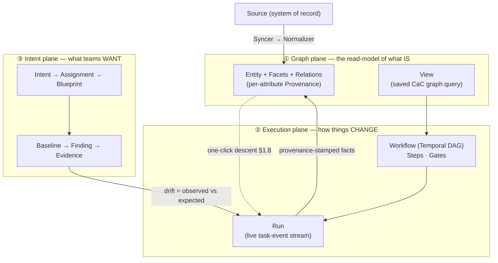

# What is Stratt?

> **New here? Read this first.** This is the plain-language orientation to Stratt — what it is, what
> problem it solves, and the mental model. For *how the pieces work at runtime* see
> **[architecture.md](architecture.md)**; for *where we are* see **[roadmap.md](roadmap.md)**; the
> **[charter](../stratt-charter.md)** is the design authority and wins over everything here.

---

## In one sentence

Stratt is an **estate-automation platform**: a typed graph of everything you manage (hosts, VMs,
devices, certs, cloud resources…) plus a durable orchestration engine, where **every tool — Ansible,
OpenTofu, Helm, Crossplane, an MCP server — is a plugin** that reads typed inputs from the graph and
writes typed, provenance-stamped results back into it.

## The bet

The successor to AWX/AAP — and to the broader systems-management category (SCCM, Jamf, Intune, Chef,
Salt) — **is not a better job runner. It is a platform layer.** Every incumbent in this space lost its
community to a *governance* failure, not a technical one (AWX frozen since 2024; AAP dropped its vanilla
installer; Chef Server EOL; Puppet forked; Salt's stewardship in question). The open hole in the market
is an actively maintained, **any-Kubernetes, config-as-code-first, structurally open** successor.

Stratt's wager is that the value isn't in *running* the tools — it's in **owning the seams between
them**, which is where an organization's automation duct-tape actually lives. Tools stay pluggable
domain backends; Stratt owns the graph they share, the orchestration that chains them, and the one
authorization/audit/cost model over all of it.

## The problem it solves

Large organizations run dozens of overlapping automation tools with no shared truth: inventory lives in
five systems, "who changed this and why" has no answer, and provisioning (Terraform) and configuration
(Ansible) and compliance (a scanner) are three disconnected islands stitched by hand.

Stratt makes the mess **legible and consolidatable, one route at a time** (the "strangler-fig" posture):

- A **typed estate graph** gives every managed thing one identity, with **per-attribute provenance** —
  every value knows which Run/Syncer wrote it, when, and from which Source. "Why is this value here?"
  always has exactly one answer.
- A **durable orchestration engine** (Temporal) chains tools into Workflows where a provisioning step's
  outputs feed straight into a configuration step's inputs — one graph, one RBAC model, one audit stream.
- An **intent layer** lets teams declare small friendly documents of *what* they want; platform-owned
  Blueprints compile *how* per device class. Per-route cost and failure accounting makes each legacy
  path legible enough to retire.

## The mental model — three planes and one spine

Everything in Stratt is one of a small set of **Named Kinds** (the vocabulary is frozen API — see the
[glossary](#glossary--the-named-kinds) below). They organize into three planes stitched by one spine:

- **① Graph plane — what *is*.** Entities (nodes) carry typed **Facets** (schema'd fragments like
  `net.ipv4`, `cert.expiry`) and **Relations** (typed edges). The graph is a **projection, never a
  second source of truth** — external systems (vCenter, Terraform state, Intune) stay authoritative;
  the graph is a rebuildable read-model written *only* by Normalizers and Run provenance. **Views** are
  saved, versioned graph queries that produce live Entity sets (this replaces the AWX notion of
  "inventory").
- **② Execution plane — how things *change*.** **Workflows** are Temporal-backed DAGs of **Steps**
  (each an Actuator running tool content, or an Action making one contracted call) with **Gates** for
  human/policy approval. A **Run** is one execution instance with a live event stream. Runs write facts
  back to the graph with provenance.
- **③ Intent plane — what teams *want*.** An **Intent** (a small "what" document) is bound by an
  **Assignment** to a View, compiled by a **Blueprint** into **Baselines** (expected state). Drift
  between expected and observed surfaces as a **Finding**, backed by immutable **Evidence**.

**The spine that ties them together is diagnosis** (charter §1.8): from any Intent you can descend the
full ladder — **Intent → Blueprint route → Workflow → Run → task event** — in one click. Hiding
*mechanism* is the product; hiding *failure* would kill trust, so the descent must always exist.

## What makes it different

- **Type the seams, not the world.** Schemas attach at plugin boundaries and to named Facets — never to
  whole Entities, never as a universal ontology. You harden typing progressively where it pays, instead
  of modeling everything up front.
- **The core is content-blind; every tool is a plugin.** After the "dark-matter" re-centering
  ([ADR-0046](adr/0046-stratt-as-substrate.md)), the Apache-2.0 core owns only the spine — graph,
  orchestration, contracts, authz, audit — with **zero tool domain logic**. Ansible, OpenTofu,
  Crossplane, MCP servers and ~20 others all live behind one **sovereign plugin port**. Adding a tool
  never touches the core.
- **Agent-native, human-first.** Every capability is exposed identically to the UI, CLI, CI, and AI
  agents (over MCP) under **one Principal model, one authorization model, one audit stream**, with
  cost/usage accounting per identity. An agent launching a Workflow lives in the same governance as a
  human clicking a button.
- **Rug-pull-proof by structure.** Apache-2.0 everything, no gated tier ever, DCO not CLA. Governance is
  the moat — the thing every predecessor got wrong.
- **One logical estate, many regions.** The fleet can be many **Cells** (region-local, single-writer
  control-plane shards) that present as one estate, active/active, with each datum having exactly one
  home Cell. The built-in default is a single Cell named `local`.

## The stack

One boring, huge-community dependency set (charter §3):

| Layer | Choice |
|---|---|
| Control plane | **Go** — K8s-native operator posture (client-go / controller-runtime), OpenAPI-first API |
| UI | **React + TypeScript + Vite** — a first-party, pure `/api/v1` client ([ADR-0091](adr/0091-ui-is-a-first-party-bundled-pure-api-client.md)) |
| Datastore | **Postgres** (the graph read-model + desired state) |
| Eventing | **NATS JetStream** (event bus, Site leaf-nodes, live SSE) |
| Orchestration | **Temporal** (durable Workflows, Schedules) |
| AuthN / AuthZ | **OIDC** (Zitadel) + **OpenFGA** (relationship-based authz) |
| Object store | any **S3-compatible** store (Evidence, Bundles, Tofu state) |
| Observability | **Loki** + **OTel** |
| Supply chain | **cosign / SLSA / SBOM** |

Python lives **only** in execution pods (the `ansible-runner` shim) and the plugin SDK — never in the
control plane. Ansible is subprocess-only (a GPL boundary the Go core never links). OpenTofu, not
Terraform.

## Status, honestly

Phases 0–2 are **code-complete**; Phase 3 is **~90%** (two Connectors deliberately deferred);
multi-region **Cells shipped ahead of plan**; and the whole platform has been **re-centered onto the
sovereign plugin port** — verified in-repo and by unit/integration tests, with a live-cluster
end-to-end run still outstanding. It is a real, substantial working platform — the Go control plane, the
React UI, ~110 ADRs, and the Helm chart are all real — **not a spike**.

**But no phase's promote/OSS exit gate is fully met.** Charter **§7.4** (employer OSPO/IP clearance) is
now **cleared** — public-facing OSS files like **[CONTRIBUTING.md](../CONTRIBUTING.md)** may exist and the
repo may go public. Each phase's own promote/OSS gate still separately needs real-world operational
evidence (an SLO window, a security review, adoption) — none of which is a coding task. The full,
evidence-backed status lives in **[roadmap.md](roadmap.md)**; the honest gaps an enterprise reviewer
would point at are tracked in **[enterprise-readiness.md](enterprise-readiness.md)**.

## Where to go next

- **[architecture.md](architecture.md)** — how the pieces actually work at runtime (the three loops, the
  component map, the plugin port, the repo layout).
- **[roadmap.md](roadmap.md)** — phase-by-phase status vs the charter, with evidence.
- **[mcp-servers.md](mcp-servers.md)** — the agent-native control surface (§1.6).
- **[ux/](ux/)** — the product UX: [screen-catalog.md](ux/screen-catalog.md),
  [design-tokens.md](ux/design-tokens.md), [competitive-teardown.md](ux/competitive-teardown.md).
- **[adr/](adr/README.md)** — the ~91 Architecture Decision Records; every decision of consequence.
- **[stratt-charter.md](../stratt-charter.md)** — the design authority.

---

## Glossary — the Named Kinds

Naming is API, frozen at v1.0 (charter §2). Use these exactly; the banned tool-specific terms
(`inventory`, `playbook`, `job template`, `CI`, `CMDB`, `resource`) never appear in the core model.

| Kind | What it is |
|---|---|
| **Entity** | A node — anything with identity (host, VM, device, cert, VPC, account). |
| **Relation** | A typed directed edge (`runs-on`, `member-of`, `issued-by`). |
| **Facet** | A named, schema'd fragment of an Entity's document. Schemas attach *here*. |
| **Provenance** | Per-attribute stamp: which Run/Syncer wrote it, when, from which Source. |
| **View** | A saved, versioned, CaC-declared graph query → a live Entity set. |
| **Source** | An external system of record. |
| **Connector** | The integration package for a Source — ships some of: **Syncer** (projection in), **Action** (one typed operation), **Emitter** (typed events out). |
| **Actuator** | An execution plugin that runs *tool content* (`ansible`, `opentofu`, `script`, `mcp`…). |
| **Contract** | JSON Schema on a Step's inputs/outputs — pinned and hash-verified. |
| **Step** / **Workflow** / **Run** | One contracted invocation / a Temporal DAG of them / one execution instance. |
| **Gate** | A human/policy approval point inside a Workflow. |
| **Trigger** | Anything that starts a Run (Schedule, Emitter event × rule, manual, API/MCP). |
| **Bundle** / **Site** / **Cell** | Signed content artifact / remote execution locus / region-local control-plane shard. |
| **Intent** → **Assignment** → **Blueprint** | A "what" document / its binding to a View / the composition that compiles it. |
| **Baseline** → **Finding** → **Evidence** | Compiled expected state / a drift result / the immutable artifact backing it. |
| **Principal** / **CredentialRef** | An identity (human or agent) / a coordinate to a credential (never the material). |

Full reference and the AWX→Stratt migration mapping: the **`/vocabulary`** skill and charter §2.
